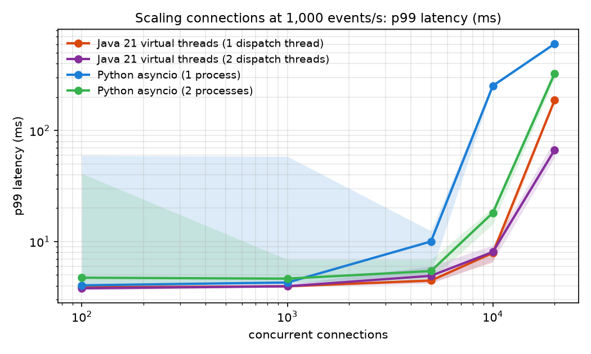
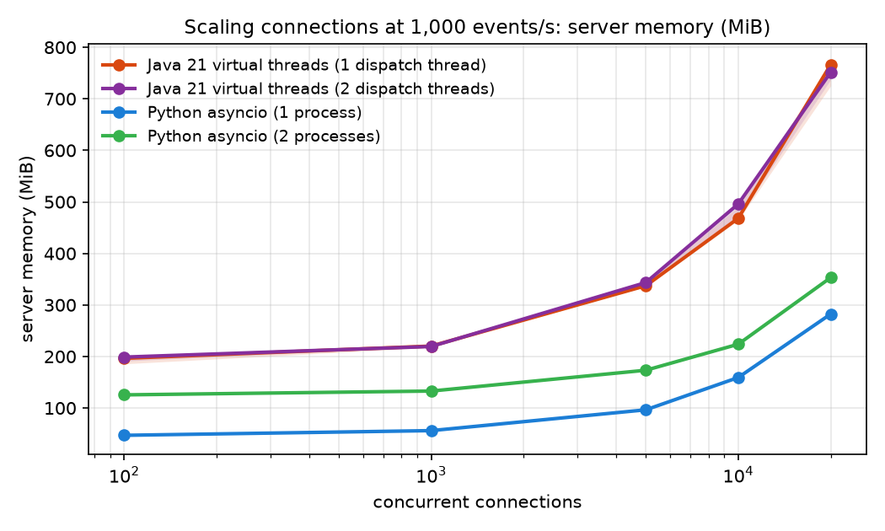
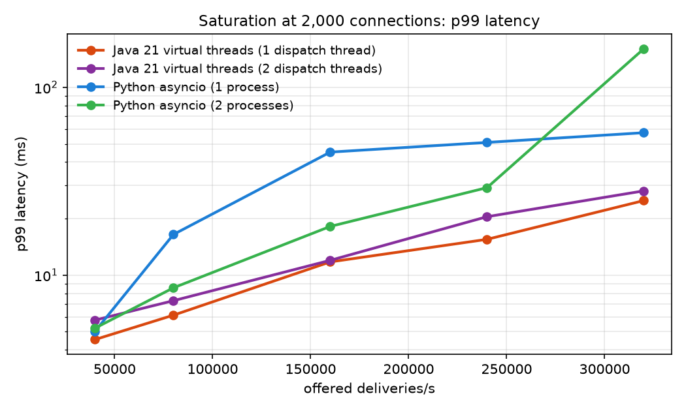
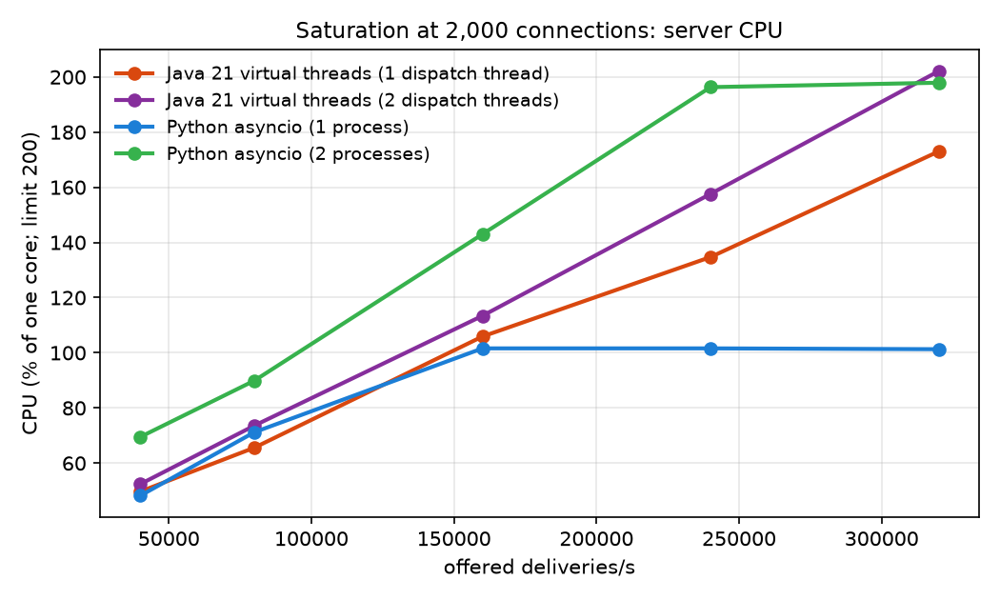
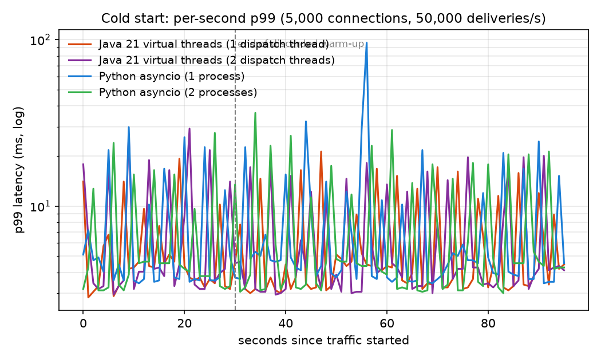

# Results

Four implementations under one harness: **Java 21 virtual threads** with 1 or 2 Kafka dispatch
threads, and **Python asyncio** with 1 or 2 processes. Every server runs in a container limited
to **2 CPUs and 1 GiB**. The clients get 6 CPUs, the producer 1 and Kafka 2, on a 12-vCPU Colima VM
(MacBook Pro, Apple M5 Pro). Every run starts a fresh server container and discards the first 30 s.
Scaling points are the **median of 3 runs** (shaded bands on the charts show min to max).
Latency is end to end: producer send → Kafka → server → client receive.

Raw data: [`results/`](../results). All tables: [`tables.md`](tables.md) (generated).
Correctness: **every run in every suite ended with 0 duplicate and 0 missing sequence numbers**,
and every client received the producer's final event.

## 1. Scaling connections (1,000 events/s, 100 streams, so 10 deliveries/s per connection)

| connections | Java, 1 dispatcher | Java, 2 dispatchers | Python, 1 process | Python, 2 processes |
|---|---|---|---|---|
| 1,000 (10k deliveries/s) | 2.0 / 4.0 ms | 2.3 / 4.0 ms | 2.4 / 4.3 ms | 2.1 / 4.6 ms |
| 5,000 (50k/s) | 2.1 / 4.5 | 2.2 / 4.9 | 2.3 / 10.0 | 2.2 / 5.4 |
| 10,000 (100k/s) | 2.1 / 7.9 | 2.3 / 8.1 | **145 / 253** | 2.5 / 18.2 |
| 20,000 (200k/s) | **87 / 188** | **2.5 / 67** | 384 / 605 | 184 / 327 |

*(p50 / p99)*

- Up to 5,000 connections all four are equivalent: about 2 ms median, which is mostly Kafka.
  The Kafka-only probe alone measures about 2 ms.
- **One asyncio event loop runs out at about 100k socket writes/s.** At 10k connections it sits at
  100% of one core and latency jumps from about 2 ms to 145 ms. That isn't a bug; it's the model:
  one thread. Two processes behind `SO_REUSEPORT` fix it at 10k (p99 18 ms) and use both cores
  (206% at 20k).
- **Java with a single dispatch thread fell over at 20k** with CPU to spare (114% of 200%). §4
  explains why; with two dispatch threads the p50 stays at 2.5 ms at 200k deliveries/s.

**Memory per connection** (slope between 5k and 20k connections): Java about 28 KiB, Python about
12 KiB. Java also starts at about 190 MiB of JVM and heap, versus about 45 MiB for Python.
Container memory includes heap the JVM has grown but not yet collected, so Java's figure is an
upper bound.

> **Finding: the first Java version ran out of memory at 10k connections.** It used 880 MiB at 5k
> connections because each connection eagerly allocated a 64 KiB `BufferedOutputStream` and an
> `InputStreamReader` (8 KiB decode buffer). An 8 KiB write buffer, which larger batches bypass,
> plus reading the command straight from the `InputStream`, brought 5k connections down to
> 337 MiB and made 10k and 20k possible. The threads were cheap; the buffers attached to them were
> not.

## 2. Saturation (2,000 connections; raising the event rate)

| offered deliveries/s | Java, 1 disp. | Java, 2 disp. | Python, 1 proc. | Python, 2 proc. |
|---|---|---|---|---|
| 80,000 | 6.1 ms | 7.3 | 16.5 | 8.6 |
| 160,000 | 11.8 | 12.0 | 45.2 (CPU 102%) | 18.2 |
| 320,000 | 24.9 | 28.1 | 57.3 (CPU 101%) | 160.5 (CPU 198%) |

*(p99)*

Everyone delivered 100% of events. With 2,000 connections, each connection receives more events
per wake-up, so writes batch well (up to 200 events per `write`), which is why single-process
Python still keeps up at 320k/s here while it could not at 10k connections × 10/s. **Cost follows
the number of socket writes and wake-ups, not the number of events.** Java's p99 grows slowly and
stays under 30 ms at 320k deliveries/s. Two Python processes reach 198% CPU and their tail rises
sharply at the top point.

## 3. JVM warm-up

| | p99, first second | seconds 1-5 | seconds 5-30 | after 30 s |
|---|---|---|---|---|
| Java (1 dispatcher) | **14.1 ms** | 3.2 | 4.3 | 3.8 |
| Java (2 dispatchers) | **17.8** | 3.4 | 4.0 | 4.2 |
| Python (1 process) | 5.1 | 4.8 | 3.6 | 4.5 |
| Python (2 processes) | 3.2 | 3.7 | 4.5 | 4.4 |

At 50k deliveries/s the JIT compiles the hot path within about a second: only the first second
shows a Java penalty. The 30 s discarded in every other run is therefore conservative. JMH
isolates the hot path with 5 warm-up iterations and 2 forks:

| hot-path operation | Java (JMH, warmed) | Python (timeit, best of 5) |
|---|---|---|
| parse one event (`stream`, `seq`) | 77-92 ns | 177 ns |
| publish to 10 subscribers | 48 ns | 766 ns |
| publish to 100 subscribers | 833 ns | 5,675 ns |
| publish to 1,000 subscribers | 10.7 µs | 54.9 µs |

Java's per-subscriber offer is about 5-7× cheaper in isolation. The end-to-end difference is much
smaller because both servers mostly wait on sockets and Kafka, which is why the macro benchmark,
not the micro one, decides.

## 4. Diagnosing Java at 20,000 connections

At 20k connections the single-dispatcher Java server had p50 = 87 ms while using only 114% of its
2 CPUs. What I tested (`results/whatif/`):

| what-if (20k connections, 200k deliveries/s) | p50 | p99 | CPU |
|---|---|---|---|
| baseline: 1 GiB, 1 dispatch thread, 2 carriers | 88.6 ms | 192 ms | 114% |
| GC logging on: 71 pauses, **0.39 s total** in the run, max 19 ms, no full GC | 86.9 | 181 | 115% |
| 2 GiB memory limit | 56.2 | 157 | 123% |
| 4 carrier threads (`jdk.virtualThreadScheduler.parallelism=4`) | 97.8 | 204 | 115% |
| per-thread CPU (`top -H`): **one carrier ~81%, the other ~8%**, Kafka thread ~7% | | | |
| **2 dispatch threads** (partitions split): carriers ~52% / ~52% | **2.3** | **62** | 161% |

- **Not GC**: pauses totalled 0.4 s over the run, and doubling memory helped only a little.
- **Not the carrier count**: with 4 carriers, one still did all the work.
- **The cause was the single dispatcher.** Every writer's virtual thread was unparked by one
  platform thread (the Kafka poll loop), and those continuations kept landing on one carrier.
  Splitting dispatch over two threads, each owning half the Kafka partitions (so per-stream order
  holds), balanced the carriers and brought p50 back to 2.3 ms.

Virtual threads remove the cost of threads, not scheduling effects. Measure per thread, not per
process.

## 5. Slow consumers and backpressure (1,000 connections, 100,000 deliveries/s)

5% of clients (56) periodically stop reading from their socket. Fast and stalled clients are
measured separately.

**With OS-default socket buffers** (stall 10 s every 30 s): **no server ever noticed.** Linux
auto-grows each socket's send buffer up to 4 MiB, so a 10 s stall (about 250 KB) sat in the kernel.
The stalled clients saw about 9.7 s delays and nothing was cut off. That's fine for correctness,
but it's a memory risk: 10,000 connections × 4 MiB is up to 40 GiB of kernel memory the server
never accounts for.

**With `SO_SNDBUF` capped at 64 KiB** (and a 16 KiB client receive window, stall 20 s every 30 s):

| | fast clients p50 / p99 | server cut-offs per run | clients complete | dup / gap |
|---|---|---|---|---|
| Java, 1 dispatcher | 2.2 / 4.8 ms | 102 | 100% | 0 / 0 |
| Java, 2 dispatchers | 2.2 / 6.0 | 102 | 100% | 0 / 0 |
| Python, 1 process | 2.8 / 13.1 | 56 | 100% | 0 / 0 |
| Python, 2 processes | 2.3 / 7.8 | 57 | 100% | 0 / 0 |

- **Fast clients are unaffected in every implementation.** The dispatch side only ever does a
  non-blocking offer, so a stalled client can't slow anyone else.
- Every stalled client was cut off when its 1,000-event queue overflowed, reconnected with its
  cursor, and replayed from the ring buffer: **0 lost, 0 duplicated**.
- **Where they diverge:** Java cut stalled clients off about twice as often (102 vs 56 per run).
  Its writer holds at most an 8 KiB buffer before blocking in `write()`. Python's writer appends a
  batch (up to 64 KiB) to the transport buffer and only then waits in `drain()`, whose high-water
  mark is another 64 KiB. So asyncio keeps about 100 KiB more per connection in user space and
  rides out more of each stall. Neither is "right": Java is stricter on memory, Python absorbs
  bursts longer. The difference comes from where each model puts its buffer, not from the queue
  size you configured.

## 6. What I'd conclude

- For **correctness** there's no difference: same protocol, same audit, zero violations
  everywhere.
- **Latency at moderate load** is equal and dominated by Kafka (about 2 ms).
- **Scaling up**, the single event loop is the first thing to break (one core). Python needs a
  process per core, which also means a Kafka consumer per process. Java uses both cores from one
  process, but only once dispatch is spread across threads.
- **Memory**: Python is about 2× leaner per connection. Java needs deliberate buffer sizing to hold
  10k+ connections in 1 GiB.
- The biggest wins in this project came from **measuring, not from the language**: buffer sizes,
  kernel send buffers and dispatch parallelism each changed results by 10× or more.
